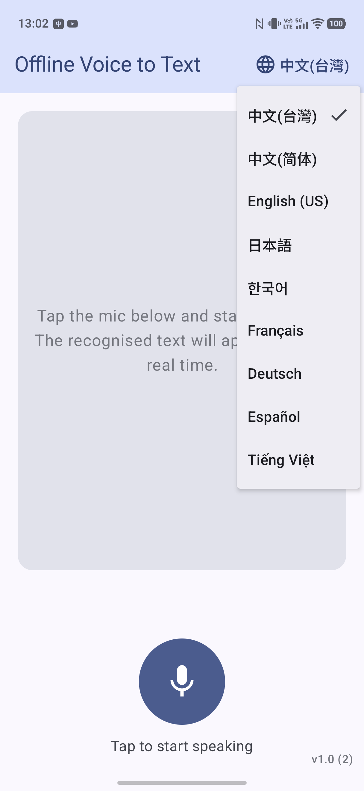
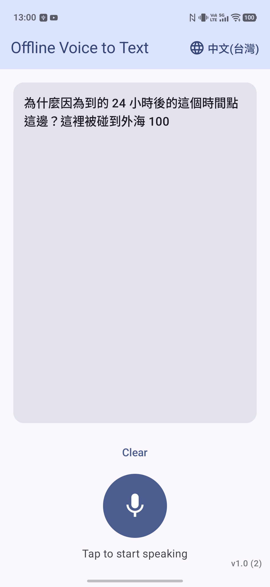

# 離線語音轉文字 — Offline Voice to Text

一個用 **ML Kit GenAI Speech Recognition**（裝置端、免 API key）的 Android App：
按麥克風 → 說話 → 即時顯示辨識文字。預設辨識語系為**繁體中文（台灣）** `cmn-Hant-TW`，並支援多國語言切換。

本專案旨在探索 **GenAI 與 AICore 在邊緣 AI（Edge AI）的實際應用**——以裝置端語音辨識為例，實測 on-device 模型的可用性、效能與使用體驗。

## 畫面 Screenshots

<p>
  
  
</p>

## 技術重點

- 100% 裝置端推論，無需網路、無需 API key。
- ML Kit GenAI Speech Recognition **Basic 模式**（Android 12 / API 31+）。
- 首次使用會由裝置下載語音模型，App 內有下載進度畫面。
- 不支援的裝置會顯示「您的裝置不能使用裝置端語音辨識」而不會崩潰。
- Jetpack Compose + Material 3 UI，日/夜主題，adaptive icon（麥克風 logo）。
- 介面多國語言（跟隨系統語言）+ 辨識語言切換選單。

> 注意：ML Kit GenAI Speech Recognition 目前是 **1.0.0-alpha1**，API 之後可能變動。
> Advanced 模式辨識更佳，但目前僅限 Pixel 10；本 App 使用 Basic 模式。
> 官方限制：bootloader 解鎖的裝置無法使用。
>
> 支援裝置與 API 詳情見官方文件：
> [ML Kit GenAI API（含支援裝置列表）](https://developers.google.com/ml-kit/genai?hl=zh-tw)

## 核心用法 — 串接 ML Kit GenAI Speech Recognizer

依賴（`app/build.gradle.kts`）：

```kotlin
implementation("com.google.mlkit:genai-speech-recognition:1.0.0-alpha1")
```

建立 recognizer、檢查/下載模型、開始辨識（皆為 suspend / Flow）：

```kotlin
import com.google.mlkit.genai.common.FeatureStatus
import com.google.mlkit.genai.common.audio.AudioSource
import com.google.mlkit.genai.speechrecognition.*
import java.util.Locale

// 1) 建立 client（Basic 模式，指定辨識語言）
val recognizer = SpeechRecognition.getClient(
    speechRecognizerOptions {
        locale = Locale.forLanguageTag("cmn-Hant-TW")   // 繁中；也支援 en-US、ja-JP…
        preferredMode = SpeechRecognizerOptions.Mode.MODE_BASIC
    }
)

// 2) 確認模型可用（首次使用需先下載模型，見 download() Flow）
if (recognizer.checkStatus() != FeatureStatus.AVAILABLE) return   // suspend

// 3) 從麥克風即時辨識（startRecognition() 回傳 Flow<SpeechRecognizerResponse>）
val request = speechRecognizerRequest { audioSource = AudioSource.fromMic() }
recognizer.startRecognition(request).collect { response ->
    when (response) {
        is SpeechRecognizerResponse.PartialTextResponse -> updatePartial(response.text)
        is SpeechRecognizerResponse.FinalTextResponse   -> appendFinal(response.text)
        is SpeechRecognizerResponse.CompletedResponse   -> { /* 本段結束 */ }
        is SpeechRecognizerResponse.ErrorResponse       -> { /* response.e */ }
    }
}

// 停止 / 釋放
recognizer.stopRecognition()   // suspend
recognizer.close()
```

> 需要 `RECORD_AUDIO` 權限（執行期請求）。`AudioSource.fromMic()` 由函式庫負責錄音（16kHz mono PCM），
> 無需自行管理 `AudioRecord`。首次使用某語言時的模型下載（`recognizer.download()`）與完整實作，
> 見 `app/src/main/java/com/genai/demo/SpeechViewModel.kt`。

## 環境需求

- JDK 21（本機用 Homebrew 的 `openjdk@21`，建置前 `export JAVA_HOME=/opt/homebrew/opt/openjdk@21`）
- Android SDK（`~/Library/Android/sdk`），compileSdk 36
- Gradle 透過 wrapper（8.11.1），AGP 8.9.1，Kotlin 2.1.0
